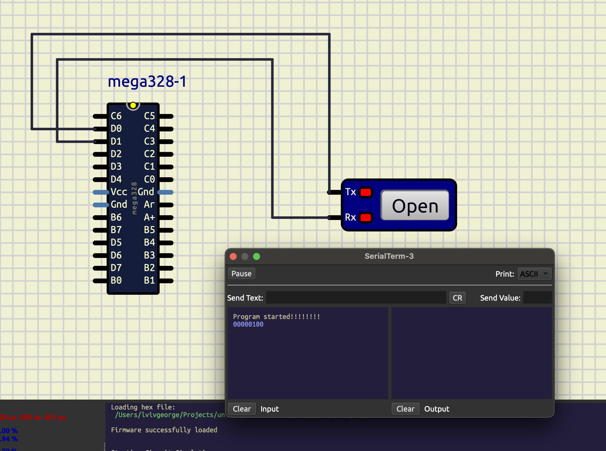

# avr-platformio-template

Simple PlatformIO project for an ATmega328 (Arduino Uno) that demonstrates
a basic UART driver: initializing the UART, printing strings, and printing
a value in binary.

## Project structure

- `src/main.c` — entry point, initializes UART and prints a startup message
- `lib/uart` — minimal UART driver (`uart_init`, `uart_write`/`uart_read`,
  `uart_print`/`uart_println`, `uart_print_uint`/`uart_print_int`/`uart_print_bin`)
- `platformio.ini` — PlatformIO config (`atmelavr`, `uno` board)

## Building

```bash
pio run
```

## SimulIDE

The circuit can be simulated without any hardware using [SimulIDE](https://simulide.com/).



The scheme above is a simple ATmega328 UART interface: the chip's `D0` (RX)
and `D1` (TX) pins are cross-wired to a serial terminal component's `Rx`/`Tx`
pins. Load the built firmware (`.hex`) onto the `mega328` part, open the
serial terminal, and start the simulation — the terminal should print
`Program started` followed by the binary output.
