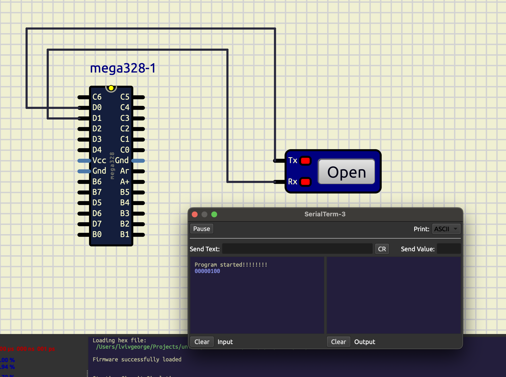

# avr-platformio-template

Simple PlatformIO project for an ATmega328 (Arduino Uno) that demonstrates
a basic UART driver: initializing the UART, printing strings, and printing
a value in binary.

## Project structure

- `src/main.c` — entry point, initializes UART and prints a startup message
- `lib/uart` — minimal UART driver (`uart_init`, `uart_write`/`uart_read`,
  `uart_print`/`uart_println`, `uart_print_uint`/`uart_print_int`/`uart_print_bin`)
- `lib/millis` — Timer0-based millisecond counter (`millis_init`, `millis`)
- `platformio.ini` — PlatformIO config (`atmelavr`, `uno` board)

## Building

```bash
pio run
```

## uart

`lib/uart` provides simple helpers for sending data over the UART, as used
in `src/main.c`:

```c
#include <avr/io.h>
#include <uart.h>

int main(void)
{
    uart_init(9600);
    uart_println("Program started");

    uart_print_bin(1 << 0);
}
```

## millis

`lib/millis` provides an Arduino-style `millis()` counter driven by Timer0,
useful for non-blocking timing instead of `_delay_ms`. Here it's used to
print a message over UART once a second:

```c
#include <avr/io.h>
#include <uart.h>
#include <millis.h>

int main(void)
{
    uart_init(9600);
    millis_init();

    uint32_t last = 0;

    while (1) {
        uint32_t now = millis();

        if (now - last >= 1000) {
            last = now;
            uart_println("tick");
        }
    }
}
```

## spi
`lib/spi` provides an hardware spi.

```c
#include <avr/io.h>
#include <util/delay.h>
#include <spi.h>

#define LATCH_PIN_DISPLAY  PB2
#define LATCH_PIN_BUTTONS  PB1

const uint8_t digit_map[10] = {
  0b00111111, // 0
  0b00000110, // 1
  0b01011011, // 2
  0b01001111, // 3
  0b01100110, // 4
  0b01101101, // 5
  0b01111101, // 6
  0b00000111, // 7
  0b01111111, // 8
  0b01101111  // 9
};

void display_digit(uint8_t digit);
uint8_t read_shift_register();

int main() {
  DDRB |= (1 << LATCH_PIN_DISPLAY) | (1 << LATCH_PIN_BUTTONS);
  spi_init();
  while (1) {
    uint8_t input = read_shift_register();

    if (bit_is_clear(input, 0)) {
      display_digit(1);
    } else if (bit_is_clear(input, 1)) {
      display_digit(2);
    } else if (bit_is_clear(input, 2)) {
      display_digit(3);
    } else {
      display_digit(0);
    }

    _delay_ms(50);
  }
}

void display_digit(uint8_t digit) {
  PORTB &= ~(1 << LATCH_PIN_DISPLAY);
  spi_transfer(digit_map[digit]);
  PORTB |= (1 << LATCH_PIN_DISPLAY);
}

uint8_t read_shift_register() {
  uint8_t data;

  PORTB &= ~(1 << LATCH_PIN_BUTTONS);
  _delay_us(1); 
  PORTB |= (1 << LATCH_PIN_BUTTONS);

  data = spi_read();

  return data;
}

```

## SimulIDE

The circuit can be simulated without any hardware using [SimulIDE](https://simulide.com/).



The scheme above is a simple ATmega328 UART interface: the chip's `D0` (RX)
and `D1` (TX) pins are cross-wired to a serial terminal component's `Rx`/`Tx`
pins. Load the built firmware (`.hex`) onto the `mega328` part, open the
serial terminal, and start the simulation — the terminal should print
`Program started` followed by the binary output.
